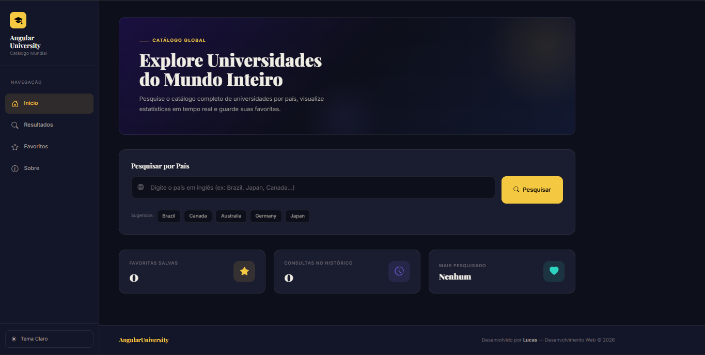
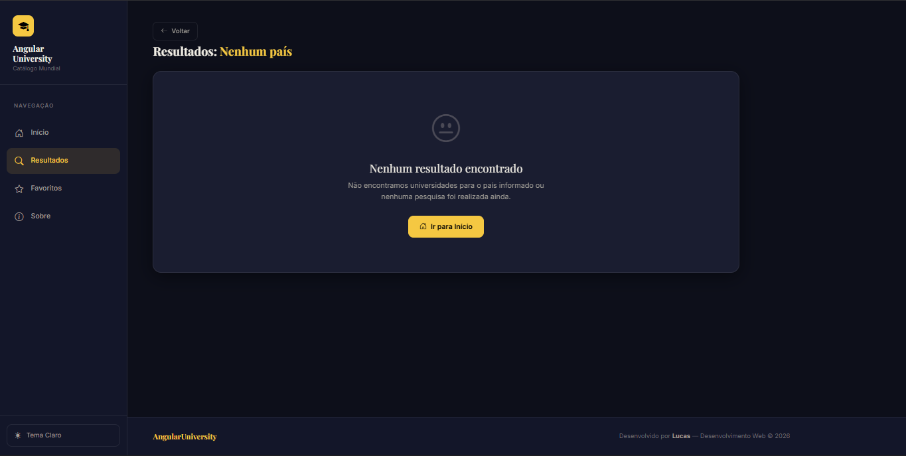
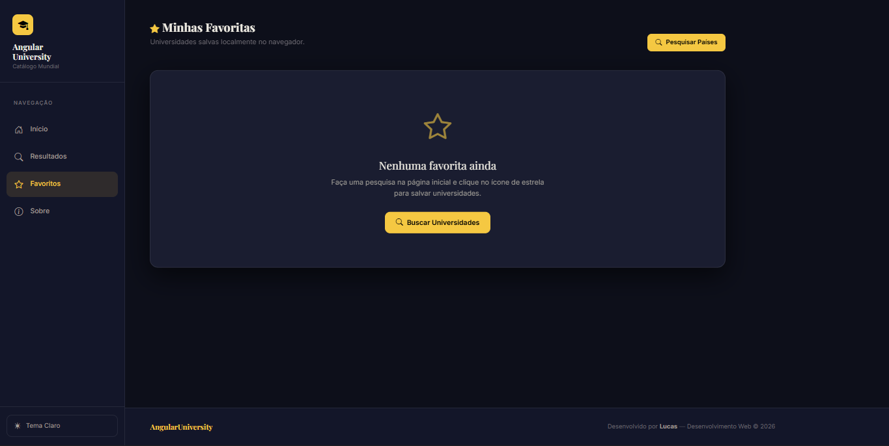

# AngularUniversity – Catálogo mundial de Universidades com Angular

Este projeto é uma aplicação web responsiva desenvolvida como parte da Atividade Final Complementar. A aplicação permite aos usuários pesquisar e visualizar informações sobre universidades de diversos países do mundo utilizando a API REST pública [Universities API](http://universities.hipolabs.com/).

---

## 🎯 Objetivo do Projeto

O principal objetivo é consolidar o aprendizado dos conceitos da disciplina de desenvolvimento web com Angular, tais como:
- Criação e reutilização de **Componentes**.
- Compartilhamento de dados e regras de negócio por meio de **Serviços**.
- Definição de **Interfaces** fortes em TypeScript.
- Configuração de **Rotas** para navegação SPA (Single Page Application).
- Manipulação e controle de entrada através de **Formulários**.
- Requisições HTTP com **HttpClient**.
- Associação de dados usando **Data Binding** (Interpolação, Property Binding, Event Binding, Two-Way Data Binding).
- Aplicação de **Diretivas** estruturais (`*ngFor`, `*ngIf`).
- Consumo de **APIs REST** públicas.
- Persistência e recuperação de preferências e favoritos em **Armazenamento Local (Local Storage)**.

---

## 🛠️ Tecnologias Utilizadas

- **Framework**: Angular (v19+)
- **Linguagem**: TypeScript
- **Estilização**: Bootstrap 5.3 (com suporte a Tema Escuro/Claro nativo) & Bootstrap Icons
- **Visualização de Gráficos**: Chart.js
- **Banco de Dados Local**: Local Storage (para histórico de buscas e lista de favoritos)
- **Requisições HTTP**: HttpClient module

---

## 💻 Estrutura do Sistema

A arquitetura do projeto segue a convenção de pastas do Angular para organização modular e escalável:

```text
src/
├── app/
│   ├── components/
│   │   ├── about/          # Tela de informações sobre o projeto e desenvolvedor
│   │   ├── favorites/      # Tela de universidades favoritas com busca local
│   │   ├── home/           # Tela inicial com busca, histórico e gráfico de estatísticas
│   │   └── results/        # Tela de listagem de universidades com paginação e filtros
│   ├── models/
│   │   ├── search-history.model.ts  # Interface para itens do histórico
│   │   └── university.model.ts      # Interface para dados da universidade
│   ├── services/
│   │   └── university.service.ts    # Serviço de busca HTTP, histórico e favoritos
│   ├── app.component.html   # Template principal (Navbar responsiva + Footer + RouterOutlet)
│   ├── app.component.ts     # Componente principal com lógica do seletor de temas (Dark/Light)
│   ├── app.routes.ts        # Definição e configuração das rotas da aplicação
│   └── app.config.ts        # Provedores de serviços globais (HttpClient, Router, etc.)
```

---

## 🚀 Instruções de Instalação e Execução

### Pré-requisitos

Para rodar este projeto, você precisa ter instalado em sua máquina:
- [Node.js](https://nodejs.org/) (versão 18 ou superior)
- Gerenciador de pacotes `npm`

### Passos para Execução

1. **Instalar as dependências do projeto:**
   ```bash
   npm install
   ```

2. **Iniciar o servidor de desenvolvimento:**
   ```bash
   npm run start
   ```
   ou
   ```bash
   npx ng serve
   ```

3. **Acessar no navegador:**
   Abra o endereço [http://localhost:4200](http://localhost:4200) no seu navegador.

---

## 📸 Demonstração das Telas

> [!NOTE]
> Abaixo estão capturas de tela representativas da interface do usuário nas versões de Tema Claro e Escuro.

| Tela Inicial (Busca, Histórico e Estatísticas com Chart.js) | Tela de Resultados (Listagem, Filtros, Favoritar, Ordenação) | Tela de Favoritos (Gerenciamento de Favoritos) |
|---|---|---|
|  |  |  |

---

Desenvolvido por Lucas de Almeida para a Atividade Final Complementar de Angular.
